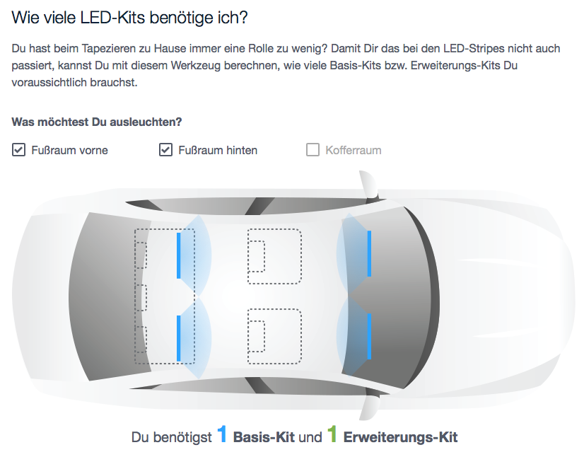

# V8 Coding Challenge

Please create a pull request for this project with your solution for the requirements shown below.

You can find images you need in the [assets directory](/assets).

## Setup and run

yarn install
yarn start

## Requirements

Make a static HTML page with a simple form that lets users click on checkboxes.

Put JavaScript and CSS code in separate `.js` and `.css` files.

Below the form, a schematic view of a car is displayed. When one or more of the
checkboxes are clicked,

* the corresponding lights are displayed on the car image
* below the car image, information about what kind of product the user needs is
  displayed

### Interaction Between Checkboxes, Images and Result

* When checkbox 1 (“Fußraum vorne”) selected:
    * Light displayed on windshield facing inward
    * Result: “Du benötigst 1 Basis-Kit”
* When checkbox 2 (“Fußraum hinten”) selected:
    * Light displayed overlapping passenger seats facing in driving direction
    * Result: “Du benötigst 1 Basis-Kit”
* When checkbox 3 (“Kofferraum”) selected:
    * Light displayed on trunk, facing backward
    * Result: “Du benötigst 1 Basis-Kit”
* When checkbox 1 and 2 are selected:
    * Light displayed on windshield facing inward
    * Light displayed overlapping passenger seats facing in driving direction
    * Result: “Du benötigst 1 Basis-Kit und 1 Erweiterungs-Kit”
* When checkbox 1 and 3 are selected:
    * Light displayed on windshield facing inward
    * Light displayed on trunk, facing backward
    * Result: “Du benötigst 2 Basis-Kits”
* When checkbox 2 and 3 are selected:
    * Light displayed overlapping passenger seats facing in driving direction
    * Light displayed on trunk, facing backward
    * Result: “Du benötigst 2 Basis-Kits”

## Copy

Headline:
> Wie viele LED-Kits benötige ich?

Introduction Text:

> Du hast beim Tapezieren zu Hause immer eine Rolle zu wenig? Damit Dir das bei den LED-Stripes nicht auch passiert, kannst Du mit diesem Werkzeug berechnen, wie viele Basis-Kits bzw. Erweiterungs-Kits Du voraussichtlich brauchst.

Sub-headline before checkboxes:

> Was möchtest Du ausleuchten?

Checkboxes:

> Fußraum vorne

> Fußraum hinten

> Kofferraum

